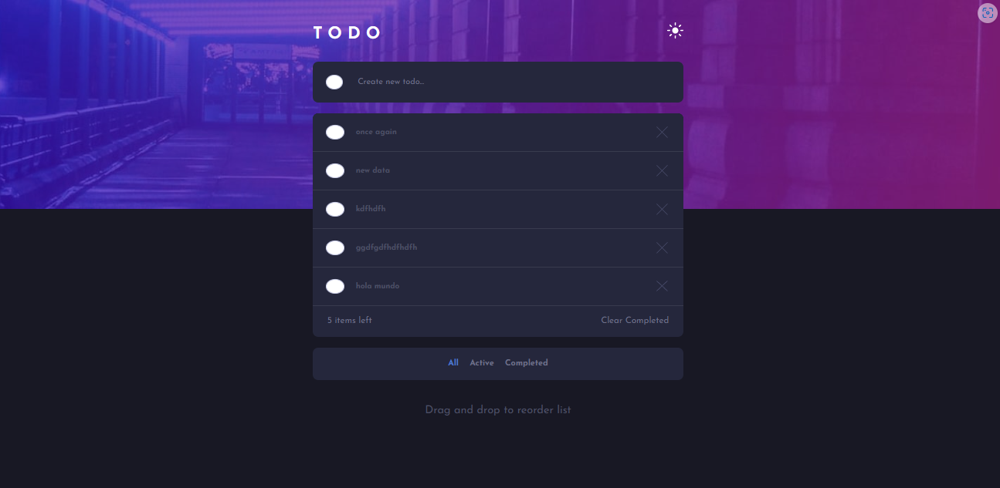
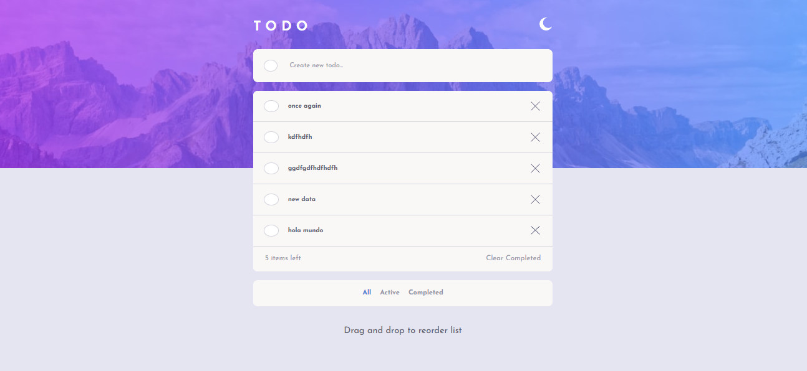
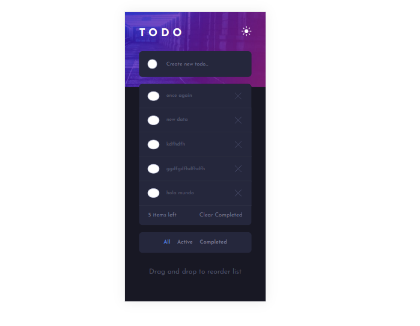
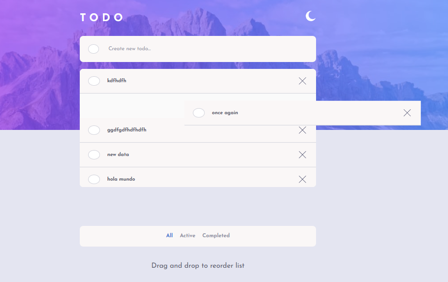

# Frontend Mentor - Todo app solution

This is a solution to the [Todo app challenge on Frontend Mentor](https://www.frontendmentor.io/challenges/todo-app-Su1_KokOW).

## Table of contents

- [Overview](#overview)
  - [The challenge](#the-challenge)
  - [Screenshot](#screenshot)
  - [Links](#links)
- [My process](#my-process)
  - [Built with](#built-with)
  - [What I learned](#what-i-learned)
  - [Continued development](#continued-development)
- [Author](#author)

## Overview

### The challenge

Users should be able to:

- View the optimal layout for the app depending on their device's screen size
- See hover states for all interactive elements on the page
- Add new todos to the list
- Mark todos as complete
- Delete todos from the list
- Filter by all/active/complete todos
- Clear all completed todos
- Toggle light and dark mode
- **Bonus**: Drag and drop to reorder items on the list

### Screenshot

### Links

- Solution URL: [Solution Link](https://github.com/JuanSebastianGB/challenges/tree/main/todo-app-main)
- Live Site URL: [Live](https://challenges-henna.vercel.app/)

## My process

### Built with

- Semantic HTML5 markup
- CSS custom properties
- CSS modules
- Flexbox
- Mobile-first workflow
- [React](https://reactjs.org/) - JS library

### What I learned

- Drag and Dropt Functionality.
- Deeper understanding of useRef Hook
- Deeper understanding of useCallBack Hook
- Deeper understanding of useCallBackMemo Hook

### Continued development

- This project was implemented having a global state with context api, but the logic was not complex, so in the future i would like to try biggest projects to handle more complex logic

## Author

- Github - [Juan Sebastian Gonzalez](https://github.com/JuanSebastianGB)
- Frontend Mentor - [@JuanSebastianGB](https://www.frontendmentor.io/profile/JuanSebastianGB)
- Twitter - [@juancho114](https://twitter.com/juancho1141)
